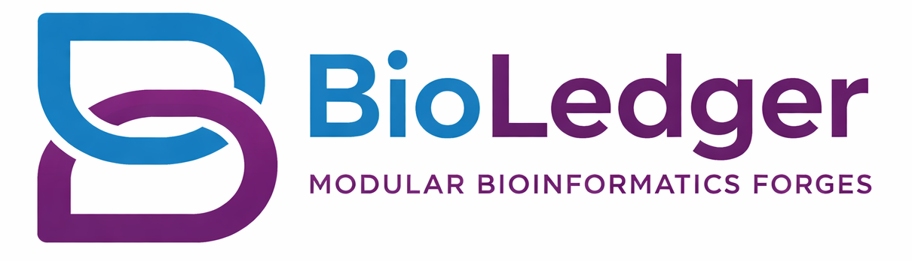

# BioLedger

<p align="center">
  
</p>

A provenance-tracking interactive analysis environment that retrospectively produces reproducible artifacts (ISA-Tab, workflows, RO-Crate).

## Core Concept

The central abstraction is a **Ledger** — a persistent, append-only log of everything the user does during an analysis session. Every tool run, LLM interaction, custom script execution, and data transformation is recorded. At any point, the user can "crystallize" the ledger into formal artifacts:

- **ISA-Tab** for data/metadata
- **Nextflow / Galaxy .ga** for the workflow
- **RO-Crate** bundling everything

The user never thinks in terms of workflows — they just work. BioLedger remembers.

## What BioLedger Records

Every action in a session creates a **LedgerEntry** — an immutable, timestamped record stored in a local SQLite database. Entries are created automatically; you don't have to do anything special to get provenance.

| When | Entry Kind | What's Captured |
|------|-----------|-----------------|
| You run a bioinformatics tool | `tool_run` | Container image, exact command, input/output files (with SHA-256 hashes), parameters, exit code, duration |
| You run a custom script | `script_run` | Same as tool_run, plus the script itself is saved as a file reference |
| You import data files | `data_import` | File paths, checksums, sizes, format metadata |
| The LLM is called | `llm_call` | Model name, prompt summary, full message history, token count, tool calls made |
| ISA-Tab metadata is generated | `metadata_gen` | Generated files, ontology terms used |
| You add a note | `user_note` | Free-form text annotation |

Each entry also carries:

- **`parent_id`** — links entries into a DAG (directed acyclic graph) so BioLedger knows that tool B's input came from tool A's output
- **`files`** — every input, output, log, and script file is recorded with its path, SHA-256 hash, size, and role
- **`tool_spec_snapshot`** — a frozen copy of the tool spec at the time of execution, so the record is self-contained even if the spec changes later

When you **crystallize** a session, BioLedger walks this DAG to produce a workflow. When you **package** it, all referenced files, the workflow, and the full ledger are bundled into an RO-Crate.

Chat messages (the back-and-forth with the LLM) are stored separately from ledger entries — they drive the conversation context but aren't part of the provenance graph.

## Hello World

The [`examples/hello_bioledger/`](examples/hello_bioledger/) directory contains a complete end-to-end walkthrough: load an ISA-Tab dataset, import a custom tool, run it in a session, crystallize a workflow, and package everything into an RO-Crate.

```bash
# Import the example tool
bioledger tool import examples/hello_bioledger/line_counter.bioledger.yaml

# Create a session
bioledger session new --name "hello world"

# Start the interactive session
bioledger resume <session_id>
```

Inside the session:

```
you> load examples/hello_bioledger/data/
assistant> Loaded dataset "Sample metadata analysis" — 3 samples, 2 organisms

you> run line_counter on s_study.txt
assistant> line_counter completed. Outputs: [summary.json]

you> quit
```

```bash
# Generate a Nextflow workflow from the session
bioledger crystallize <session_id>

# Bundle into an RO-Crate
bioledger package <session_id>
```

ISA-Tab to reproducible package without writing workflow syntax. See the [full walkthrough](examples/hello_bioledger/README.md) for details on what BioLedger records at each step.

### More examples

- **[Galaxy tool import](examples/galaxy_tool_import/)** — import existing Galaxy tool wrappers into BioLedger
- **[CSV to ISA-Tab](examples/csv_to_isatab/)** — start from a plain samplesheet and convert to structured metadata

## Prerequisites

### LLM API Key

BioLedger uses LLM providers (OpenAI by default) for interactive analysis, tool parsing, and ontology lookup. Set your API key as an environment variable or in a `.env` file in your working directory:

```bash
# OpenAI (default)
export OPENAI_API_KEY="sk-..."

# Or use Anthropic
export ANTHROPIC_API_KEY="sk-ant-..."

# Or use Google Gemini
export GOOGLE_API_KEY="..."
```

Or copy the example `.env` file and fill in your keys (BioLedger loads it automatically):

```bash
cp .env.example .env
# Edit .env with your API key
```

The default model is `openai:gpt-4o`. To use a different provider, set both the API key and the model:

```bash
# Example: switch to Google Gemini
GOOGLE_API_KEY=...
BIOLEDGER_DEFAULT_MODEL=google-gla:gemini-2.5-flash
```

### Docker (optional)

Tool execution runs inside Docker containers. Install [Docker](https://docs.docker.com/get-docker/) if you plan to run bioinformatics tools through BioLedger.

## Installation

```bash
# Core only
pip install -e .

# With all optional dependencies
pip install -e ".[cli,isaforge,toolforge,analysis,crateforge,dev]"
```

Or with conda:

```bash
conda create -n bioledger python=3.11 -y
conda activate bioledger
pip install -e ".[cli,isaforge,toolforge,analysis,crateforge,dev]"
```

## Quick Start

```bash
# Create a new analysis session
bioledger session new --name "RNA-seq analysis"

# Resume an interactive session
bioledger resume <session_id>

# List sessions
bioledger session list
```

## Architecture

BioLedger is organized into **forges** — specialized modules that handle different aspects of the analysis lifecycle:

| Forge | Purpose |
|-------|---------|
| **ISAForge** | ISA-Tab metadata generation and validation |
| **ToolForge** | Tool spec management, translation (Galaxy ↔ Nextflow) |
| **AnalysisForge** | Interactive analysis, tool execution, workflow crystallization |
| **CrateForge** | RO-Crate packaging with full provenance |

---

### ToolForge — Tool Spec Management

ToolForge manages bioinformatics tool specifications. Import tools from Galaxy XML or Nextflow modules, validate them, search the local store, and export to either format.

```bash
# Import a Galaxy tool wrapper
bioledger tool import fastqc.xml

# Import a Nextflow module
bioledger tool import trimmomatic.nf

# Import a BioLedger YAML spec directly
bioledger tool import specs/samtools_sort.bioledger.yaml

# Validate a spec (--strict treats warnings as errors)
bioledger tool validate ~/.bioledger/tools/fastqc.bioledger.yaml
bioledger tool validate specs/my_tool.bioledger.yaml --strict

# List all tools in the local store
bioledger tool list

# Search by name
bioledger tool list --search "fastqc"

# Show tool details
bioledger tool show fastqc

# Export to Nextflow DSL2 or Galaxy XML
bioledger tool export fastqc --format nextflow
bioledger tool export fastqc --format galaxy -o fastqc_exported.xml
```

Tool specs are stored as YAML in `~/.bioledger/tools/` and use a two-layer model:

- **ExecutionSpec** — container, command template, inputs, outputs, parameters
- **InterfaceSpec** (optional) — UI hints, conditionals, repeat blocks

**Authoring a new tool?** See the full spec reference: [`src/bioledger/toolspec/TOOLSPEC.md`](src/bioledger/toolspec/TOOLSPEC.md). It documents every field, the command template variables, the container mount layout, validation rules, and the migration story.

---

### AnalysisForge — Interactive Analysis

AnalysisForge powers the interactive chat loop. Load a dataset (CSV samplesheet or ISA-Tab directory), get LLM-powered tool suggestions, run tools in Docker containers, and review outputs — all tracked in the ledger.

```bash
# Start or resume an interactive session
bioledger resume <session_id>
```

Inside the session, use `load` with a CSV samplesheet or ISA-Tab directory:

```
you> load samples.csv
assistant> Loaded dataset "Samples" — 3 samples, 2 organisms (Mus musculus, Homo sapiens)

you> load /path/to/isa-tab/
assistant> Loaded dataset "my_rnaseq" (3 samples, formats: fastq, txt).
           Suggested workflow:
           1. Quality control (FastQC)
           2. Trimming (Trimmomatic)
           3. Alignment (HISAT2)

you> run fastqc on the raw reads
assistant> Suggested: fastqc
           Params: {threads: 4}
           Run this tool? [y/N]: y
assistant> fastqc completed. Outputs: [sample1_fastqc.html, sample1_fastqc.zip]

you> review
  TOOL [abc123] tool_run: fastqc  outputs=[sample1_fastqc.html, ...]
  DATA [def456] data_import: my_rnaseq

you> quit
```

#### Crystallize Workflows

Convert a session's tool runs into a reproducible workflow:

```bash
# Generate Nextflow DSL2 (default)
bioledger crystallize <session_id>

# Generate Galaxy workflow JSON
bioledger crystallize <session_id> --format galaxy

# Include only specific entries
bioledger crystallize <session_id> --entry abc123 --entry def456
```

---

### ISAForge — Metadata & Datasets

ISAForge handles ISA-Tab metadata — loading existing ISA-Tab archives, building new investigation/study/assay structures, and validating them against ontology terms via the OLS4 API.

---

### CrateForge — RO-Crate Packaging

Package a session (or selected entries) into a self-contained [RO-Crate](https://www.researchobject.org/ro-crate/):

```bash
# Package entire session
bioledger package <session_id>

# Package specific entries to a custom directory
bioledger package <session_id> --entry abc123 --entry def456 --output-dir ./my_crate
```

The resulting crate includes:

- `ro-crate-metadata.json` — full provenance graph
- `workflow.nf` — crystallized Nextflow workflow
- `ledger.json` — raw ledger entries
- All input/output data files referenced by included entries

---

## Session Management

```bash
bioledger session new --name "My analysis" --description "RNA-seq of mouse liver"
bioledger session list                  # active sessions
bioledger session list --all            # include archived
bioledger session show <session_id>     # details + recent chat
bioledger session rename <session_id> "Better name"
bioledger session describe <session_id> "Updated description"
bioledger session archive <session_id>  # soft-delete
```

## Configuration

BioLedger reads configuration from environment variables prefixed with `BIOLEDGER_`:

| Variable | Default | Description |
|----------|---------|-------------|
| `OPENAI_API_KEY` | — | OpenAI API key (or use another provider's key) |
| `ANTHROPIC_API_KEY` | — | Anthropic API key |
| `GOOGLE_API_KEY` | — | Google AI API key |
| `BIOLEDGER_DEFAULT_MODEL` | `openai:gpt-4o` | LLM model in `provider:model` format (also switches primary task models) |
| `BIOLEDGER_HOME_DIR` | `~/.bioledger` | Data directory for sessions, tools, cache |

Setting `BIOLEDGER_DEFAULT_MODEL` switches the provider for all primary tasks. Utility tasks (parsing, fixing, review) stay on `openai:gpt-4o-mini` by default. Providers: `openai`, `anthropic`, `google-gla`, `google-vertex`, `groq`, `ollama`. See `.env.example` for examples.

## Development

```bash
pip install -e ".[dev]"
pytest tests/ -v
ruff check src/ tests/
mypy src/bioledger
```

## License

MIT
